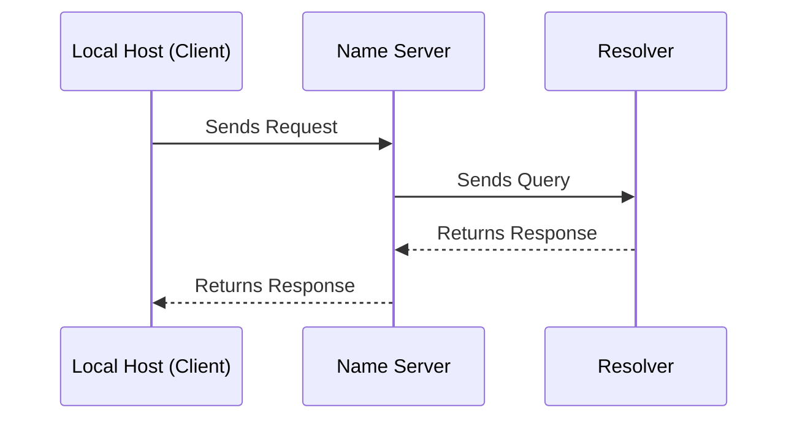

## Introduction

Since Go was released around 2012, I've tried to learn it a few times, reading bits here and there. My last serious attempt led me to work on [oj](https://github.com/lmmendes/oj), but either work got in the way, or I couldn't find a compelling project to fully immerse myself in the language beyond theoretical understanding.

This time, with a few free days during my vacation, I stumbled upon [Codecrafters.io](https://app.codecrafters.io/r/faithful-spider-810040)<sup>1</sup> and decided to take on their "Build Your Own DNS Server" challenge using Go. This project set the stage for me to learn the basics of Go while building a simple DNS server, diving deep into the DNS protocol, message formats, and other internals.

I'm using this post as a journal of my journey, documenting what I've learned so far. My focus wasn't on creating a perfect solution or polished architecture but rather on exploring Go's language primitives and hacking my way through the DNS protocol. I'll highlight the quirks I found in the RFC, the moments where I needed a refresher, and the insights that became essential to my understanding.

<sup>1</sup> The link includes referral to [codecrafters.io](https://app.codecrafters.io/r/faithful-spider-810040)

## Understanding DNS: A Quick Overview

For reference I'm using [RFC 1035](https://www.rfc-editor.org/rfc/rfc1035) which focuses on Domain Names - Implementation and Specification. Although the RFC is dense, it's the best resource for understanding the DNS protocol. I'll summarize the most important parts here.

At its core, DNS is a simple request-response protocol. The client sends a query to the server, and the server responds with an answer.



### DNS Message Format

The DNS message format is a binary structure consisting of a header and a body. The header contains metadata about the message, such as the query type, query class, and response code. The body contains the actual query and response data, which are organized into four sections: `Question`, `Answer`, `Authority`, and `Additional`. Here’s a simplified representation from the RFC:

```text
+---------------------+
|        Header       |
+---------------------+
|       Question      | the question for the name server
+---------------------+
|        Answer       | RRs answering the question
+---------------------+
|      Authority      | RRs pointing toward an authority
+---------------------+
|      Additional     | RRs holding additional information
+---------------------+
```

In this implementation, we'll focus on the `Header`, `Question`, and `Answer` sections. The `Authority` and `Additional` sections are optional and won't be covered.

#### DNS Message Header

The header is 12 bytes (96 bits) long and contains 12 fields in total. Here’s the header format from the RFC:

```text
                               1  1  1  1  1  1
 0  1  2  3  4  5  6  7  8  9  0  1  2  3  4  5
+--+--+--+--+--+--+--+--+--+--+--+--+--+--+--+--+
|                      ID                       |
+--+--+--+--+--+--+--+--+--+--+--+--+--+--+--+--+
|QR|   Opcode  |AA|TC|RD|RA|   Z    |   RCODE   |
+--+--+--+--+--+--+--+--+--+--+--+--+--+--+--+--+
|                    QDCOUNT                    |
+--+--+--+--+--+--+--+--+--+--+--+--+--+--+--+--+
|                    ANCOUNT                    |
+--+--+--+--+--+--+--+--+--+--+--+--+--+--+--+--+
|                    NSCOUNT                    |
+--+--+--+--+--+--+--+--+--+--+--+--+--+--+--+--+
|                    ARCOUNT                    |
+--+--+--+--+--+--+--+--+--+--+--+--+--+--+--+--+
```

| Field   | Size (bits) | Description                                                                    |
| ------- | ----------- | ------------------------------------------------------------------------------ |
| ID      | 16          | A 16-bit identifier assigned by the client to the query.                       |
| QR      | 1           | Indicates whether the message is a query (0) or a response (1).                |
| Opcode  | 4           | Specifies the type of query.                                                   |
| AA      | 1           | Indicates whether the server is authoritative for the domain.                  |
| TC      | 1           | Indicates whether the message was truncated.                                   |
| RD      | 1           | Indicates whether recursion is desired.                                        |
| RA      | 1           | Indicates whether recursion is available.                                      |
| Z       | 3           | Reserved for future use.                                                       |
| RCODE   | 4           | Indicates the response code.                                                   |
| QDCOUNT | 16          | Specifies the number of entries in the question section.                       |
| ANCOUNT | 16          | Specifies the number of resource records in the answer section.                |
| NSCOUNT | 16          | Specifies the number of name server resource records in the authority section. |
| ARCOUNT | 16          | Specifies the number of resource records in the additional section.            |

#### DNS Question Format

The question section is a variable-length section that contains the query. The format is as follows:

| Field  | Size (bits) | Description                                        |
| ------ | ----------- | -------------------------------------------------- |
| QNAME  | Variable    | A domain name represented as a sequence of labels. |
| QTYPE  | 16          | Specifies the type of query.                       |
| QCLASS | 16          | Specifies the class of the query.                  |

#### DNS Answer Format

The answer section is a variable-length field that contains the response. The format is as follows:

| Field    | Size (bits) | Description                                        |
| -------- | ----------- | -------------------------------------------------- |
| NAME     | Variable    | A domain name represented as a sequence of labels. |
| TYPE     | 16          | Specifies the type of resource record.             |
| CLASS    | 16          | Specifies the class of the resource record.        |
| TTL      | 32          | Specifies the time to live.                        |
| RDLENGTH | 16          | Specifies the length of the RDATA field.           |
| RDATA    | Variable    | Contains the data of the resource record.          |

For completeness, the `Answer`, `Authority` and `Additional` sections have the same format, as described in [4.1.3. Resource record format](https://www.rfc-editor.org/rfc/rfc1035#section-4.1.3).

### DNS Record Types

[RFC 1035](https://www.rfc-editor.org/rfc/rfc1035) describes 21 record types, but we are going to focus on implementing the A record for simplicity.

| Record Type | Value | Description                                                                          |
| ----------- | ----- | ------------------------------------------------------------------------------------ |
| A           | 1     | Address record. Maps a domain name to an IPv4 address.                               |
| NS          | 2     | Name server record. Specifies the authoritative name servers for a domain.           |
| MD          | 3     | Mail destination record. Specifies the mail exchange servers for a domain. (Obsolete - use MX)           |
| MF          | 4     | Mail forwarder record. Specifies the mail forwarders for a domain. (Obsolete - use MX)                  |
| CNAME       | 5     | Canonical name record. Specifies an alias for a domain.                              |
| SOA         | 6     | Start of authority record. Specifies the authoritative information about a domain.   |
| MB          | 7     | Mailbox record. Specifies the host that handles mail for a domain.(EXPERIMENTAL)                   |
| MG          | 8     | Mail group record. Specifies a mailbox that is a member of a mail group. (Experimental)             |
| MR          | 9     | Mail rename record. Specifies a new name for a mailbox. (Experimental)                             |
| NULL        | 10    | Null record. Reserved for future use. (Experimental)                                               |
| WKS         | 11    | Well-known services record. Specifies the well-known services supported by a domain. |
| PTR         | 12    | Pointer record. Specifies a domain name that points to another domain.               |
| HINFO       | 13    | Host information record. Specifies the host CPU and operating system.                |
| MINFO       | 14    | Mailbox information record. Specifies the mailbox and error mailbox for a domain.    |
| MX          | 15    | Mail exchange record. Specifies the mail exchange servers for a domain.              |
| TXT         | 16    | Text record. Specifies text information.                                             |
| AXFR        | 252   | Request for a transfer of an entire zone.                                            |
| MAILB       | 253   | Request for mailbox-related records.                                                 |
| MAILA       | 254   | Request for mail agent-related records. (Obsolete - see MX)                                             |
| \*          | 255   | Request for all records.                                                             |


Not to sidetrack the conversation, but I found the `DNS ANY (*)` and HINFO records particularly interesting, so I decided to take a look at the latest version of the RFC, [RFC 8482](https://www.rfc-editor.org/rfc/rfc8482). This RFC deprecates the DNS ANY record, which previously allowed clients to request all records associated with a domain—a feature that was often misused and created unnecessary load on DNS servers.

Interestingly, the HINFO record, originally designed to reveal the OS and CPU type of a host, is being repurposed for other uses, mainly because exposing such detailed system information poses security concerns.

#### Example Responses from Different Resolvers

Interestingly, different DNS resolvers have unique approaches to handling this deprecation, as seen in the Google DNS Resolver (8.8.8.8) and Cloudflare DNS Resolver (1.1.1.1) responses for the facebook.com domain.

##### Google DNS Resolver (8.8.8.8) Response

```shell
dig ANY facebook.com @8.8.8.8
```
````text
; <<>> DiG 9.10.6 <<>> ANY facebook.com @8.8.8.8
;; global options: +cmd
;; Got answer:
;; ->>HEADER<<- opcode: QUERY, status: NOERROR, id: 26766
;; flags: qr rd ra; QUERY: 1, ANSWER: 1, AUTHORITY: 0, ADDITIONAL: 1

;; OPT PSEUDOSECTION:
; EDNS: version: 0, flags:; udp: 512
;; QUESTION SECTION:
;facebook.com.			IN	ANY

;; ANSWER SECTION:
facebook.com.		21600	IN	HINFO	"RFC 8482" ""
```

Google's DNS resolver replies with a single `HINFO` record containing the RFC 8482 string, indicating that ANY queries are no longer fully supported.

##### Cloudflare DNS Resolver (1.1.1.1) Response

```shell
dig ANY facebook.com @1.1.1.1
```

```text
; <<>> DiG 9.10.6 <<>> ANY facebook.com @1.1.1.1
;; global options: +cmd
;; Got answer:
;; ->>HEADER<<- opcode: QUERY, status: NOTIMP, id: 33667
;; flags: qr rd ra; QUERY: 1, ANSWER: 0, AUTHORITY: 0, ADDITIONAL: 1

;; OPT PSEUDOSECTION:
; EDNS: version: 0, flags:; udp: 1232
;; QUESTION SECTION:
;facebook.com.			IN	ANY
```

Cloudflare’s approach is to respond with a `NOTIMP` (Not Implemented) status code, indicating that the resolver does not support the `ANY` record type.


### DNS Format Limits

The DNS protocol has a few limitations that impact domain usage, as detailed in the [Size limits](https://www.rfc-editor.org/rfc/rfc1035#section-2.3.4) section of the RFC. Key limitations include:

- **Message Size**: The maximum size of a DNS message is 512 bytes when using UDP, due to the protocol’s design. This was designed to ensure compatibility with older networks and avoid IP fragmentation, which can lead to reliability issues.
- **Domain Name Length**: The maximum length of a domain name is 255 octets, including labels and separators. Meaning that a domain e.g., `www.geeky.goofy.gadget.guru` can't exceed 255 characters.
- **Label Length**: Each label within a domain name (e.g., `geeky` in `www.geeky.goofy.gadget.guru`) is limited to 63 octets.

## Implementing DNS Protocol with Go

Now that we have a good understanding of the DNS protocol, let's implement a simple DNS server in Go. We will create a server that listens on a specific port and responds to A record queries for a specific domain.

```go
```
